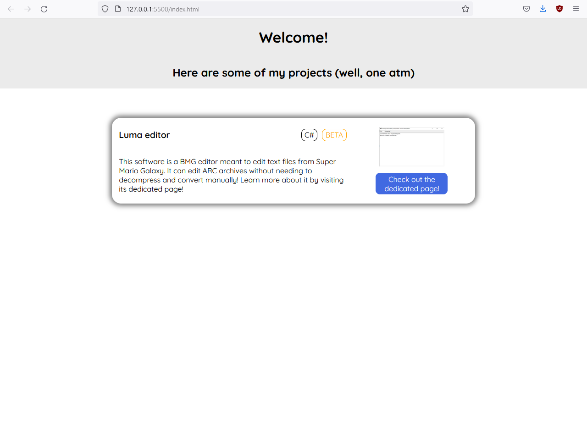

# Bussun's Website
Website website

Seriously though this is the GitHub repository of my (somewhat) personnal website.
I created it to display some of my projects (some of which are on GitHub). It (more or less) serves as a personal portfolio.

[Link to my GitHub Pages website](https://bussun.github.io)

A full rewrite is scheduled since I've acquired new knowledge in web develoment and I don't like the UI anymore. (and let's be honnest, it is kinda empty too...)

## Screenshot

